<div align="center">
  
</div>

## 
## What is Mocktail
**Mocktail is a lightweight, Bash-based HTTP server for creating mock APIs with integrated support for the hosting of static and dynamic web applications.** Originally conceived as a simple utility for serving predefined, static, JSON API responses, **Mocktail evolved as a result of the need to generate fully dynamic JSON API responses**. To facilitate this process **a brand new, dynamic, HTTP Web Serving sub-system was put in place, based on Bashlets (special Mocktail,server-side Bash scripts that receive HTTP requests, processes them, and returns valid HTTP responses)**. This capability was then later exposed to third-party developers to allow them to **build and prototype dynamic web applications, on top of Mocktail Server, without having to install a full application development environment** like Python,Go Java,etc **all thats required is a BASH**, which comes installed, as standard, on most Linux distributions.

> **NOTE:** Mocktail is purpose-built for mocking APIs. Whilst static and dynamic web hosting are supported, as complementary features, for rapid local or test environment deployment, Mocktail is **not** intended for general web serving in a production environment.

## Highlights

- Intuitive UI for the easy creation of Mock API collections and their respective endpoints; great for rapid REST-style, API testing.

- Being fully written in BASH, with only standard command-line tool dependencies, Mocktail is **super easy to deploy to a cloud server or VPS thereby allowing teams to share and/or evolve Mock APIs** in a test or QA environment.

- Support for **static website hosting** for HTML, CSS, JavaScript, images, and static assets
- Support for **dynamic web application hosting** using Bashlets (special server-side Bash Scripts), no other languages or development environments required.
- Built-in admin and mocking dashboards for simple server management and monitoring
- Simple startup flow with a single `mocktail` launcher script

## Typical usage

Mocktail is ideal when you need to:

- simulate backend APIs without writing full services
- share simulated backend APIs in a test or QA environment between one or multiple engineering teams.
- test request/response flows before integrating with real systems
- host a frontend prototype or static site locally
- host a lightweight dynamic web app using nothing more than Bash.


## Quick start

You can get started with Mocktail in 3 simple steps:

1) Firstly `clone` the project from the official SharefulNetworks GitHub repository. 
```bash
git clone https://github.com/SharefulNetworks/shareful-utils-mocktail.git
```

2) Next navigate the to the project root directory and give the `mocktail` script execute permissions.
```bash
cd shareful-utils-mocktail
chmod +x mocktail
```

3) Finally, start the server by executing the `mocktail` script:
```bash
./mocktail
```

 

If the server was started without error, when you navigate to `http://localhost:3333`, you should see the Mocktail **start page** in your browser. From there you can select the **Settings** card to be taken to the main Mocktail dashboard:

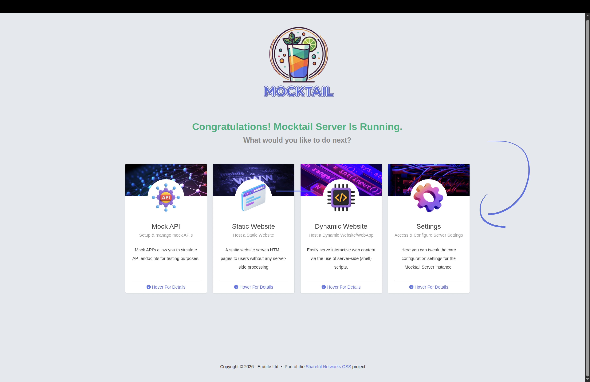

If this is your first launch, the app will guide you through creating the admin account and logging in:
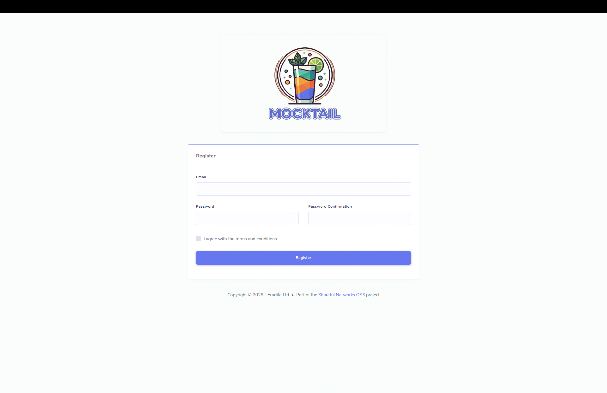

Once you've logged in, you willl be taken to the main Mocktail dashboard where you can manage server settings/configuration, view stats, and access the built-in documentation library:
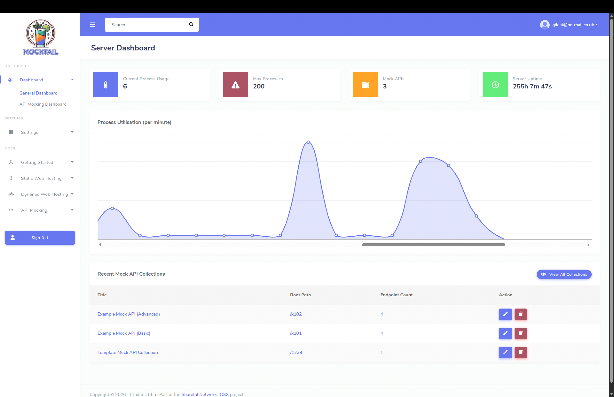

Alternatively, jump straight to the main Mocktail dashboard, you can navigate to the following URL in your browser: `http://localhost:3333/sys/admin/dashboard` once the server has been started. Again, **you will be prompted to login/create an account**, if you have not done so already.


## Configuration

Mocktail Server settings can be configured both via the web UI and directly by editing the `res/config.json` file. Using the web UI is more straightforward however it may not surface all available configuration options, so for advanced users, direct editing of the `res/config.json` file is also supported.

#### Via Web UI

Once you're logged in, you can view and manage server settings from the **Settings** menu item on the left of the screen:
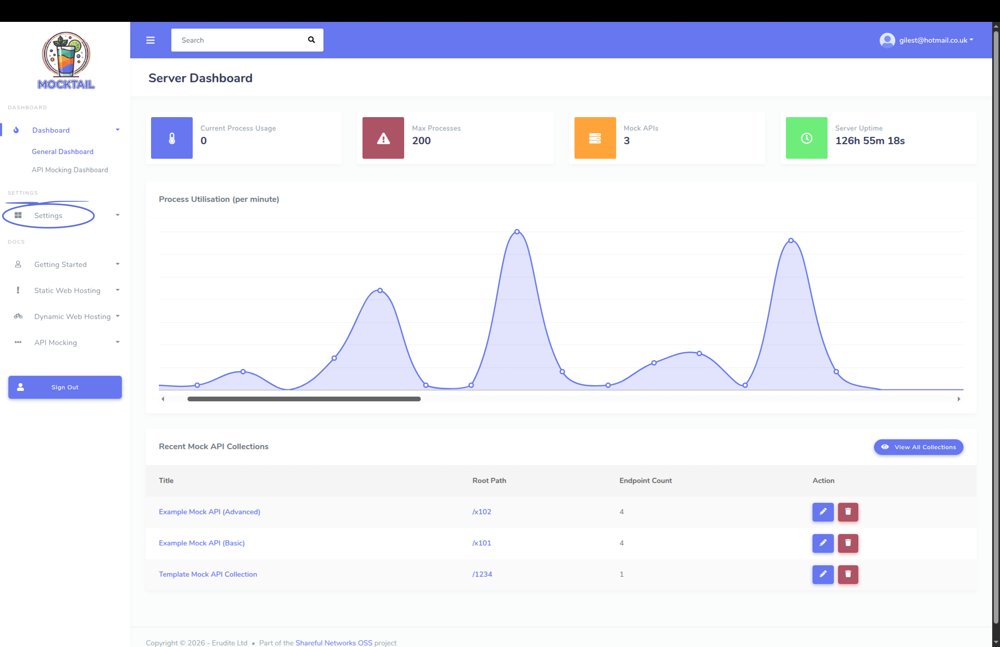

This will take you to the root settings page where you can view and edit the **General** and **Security** settings for the server:
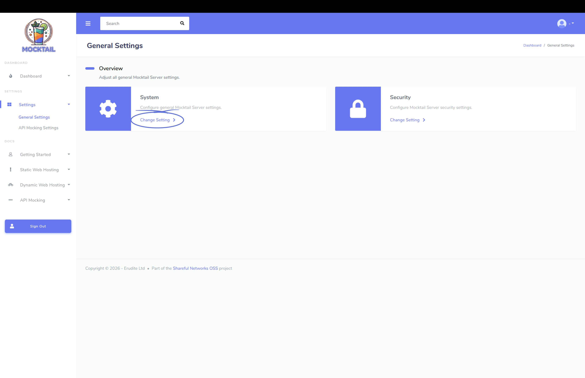

Selecting either option will take you to the **settings details page** where the appropriate settings, for the selected category, can be adjusted:
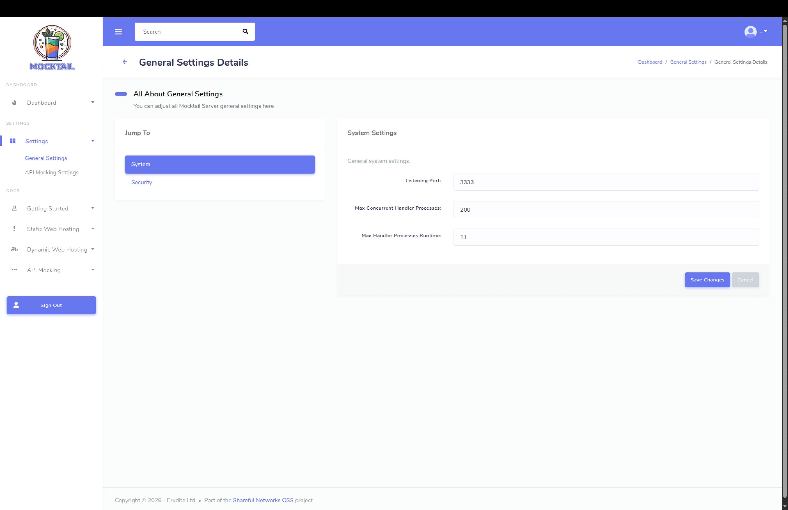


The settings are stored in a JSON file located at `res/config.json` and are loaded into the server on startup. Thus, **any changes made to the settings via the UI will require a server restart to take effect.** The server can be restarted by stopping the server and then re-running the `./mocktail` script.


#### Via JSON config file

You may also configure the Server settings directly, they all live in the `res/config.json`. file and will look as follows:

```json
{
  "GeneralSettings": {
    "ListeningPort": 3333,
    "MaxConcurrentProcesses": 200,
    "MaxHandlerProcessRuntime": 11,
    "LogLevel": 3
  },
  "SecuritySettings": {
    "AuthenticationMethod": "passphrase-and-token",
    "AuthTokenCookieName": "mocktail_auth_token",
    "TokenExpirationMinutes": 30,
    "EnableCORS": false
  }
}
```

Like editing via the web UI, **any changes made to the settings via the config.json file will require a server restart to take effect.** The server can be restarted by stopping the server and then re-running the `./mocktail` script.

## Core features

### 1) API mocking

The **fastest way to get started is through the Mocktail API Mocking Web UI**. Once the server is running, open the start page at `http://localhost:3333` in the browser and select the API Mocking card: 
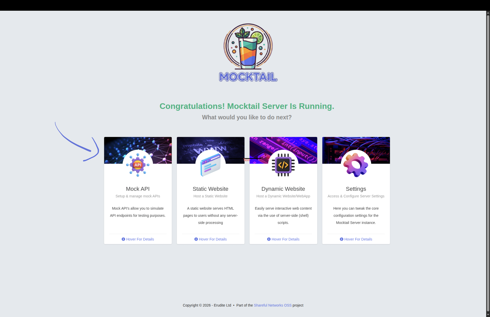

This will take you to the API Mocking Dashboard interface where you can create a collection, add endpoints, and manage mock responses without writing any code:


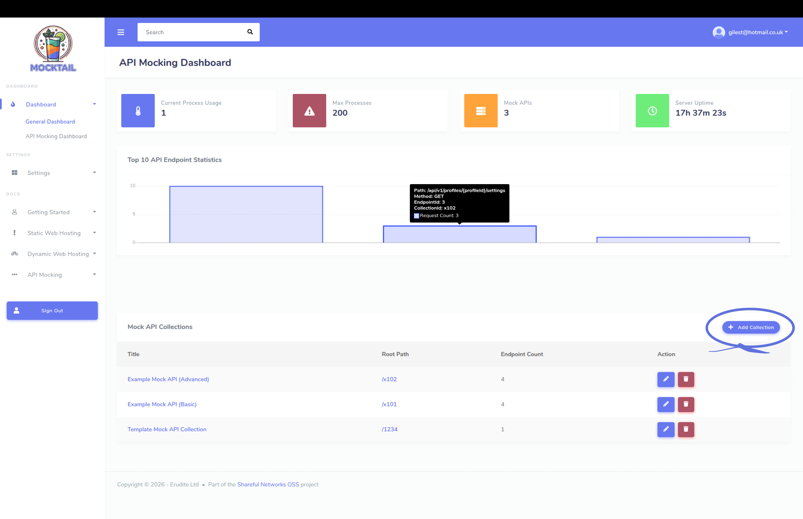

The intuitive interface makes it easy to get started with API mocking. See the [docs](#Documentation) for a more detailed description of how to create and manage Mock API collections and endpoints.

### 2) Static web hosting

Mocktail can function as a static web server for HTML, CSS, JS, and other assets. The default static public web hosting directory is:

```text
res/usr/www
```

Put your HTML, CSS, JS, or other assets there and they will be served by the server. If you place an `index.html` in the root of the web folder, it becomes the default page.

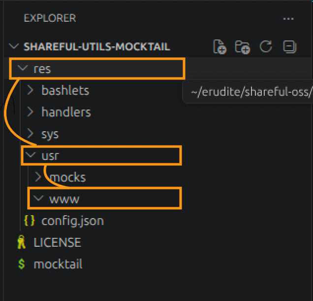

### 3) Dynamic web hosting with Bashlets

#### 3.1 Overview
Dynamic hosting is built around Bashlet scripts. A Bashlet is a specialised Mocktail Bash script that receives HTTP requests, processes them, and returns a response. The server routes the request into the appropriate Bashlet **endpoint function** based on it associated path and method.

This request lifecycle is described in the  [docs](#Documentation) and is a good mental model for how Mocktail handles incoming traffic:

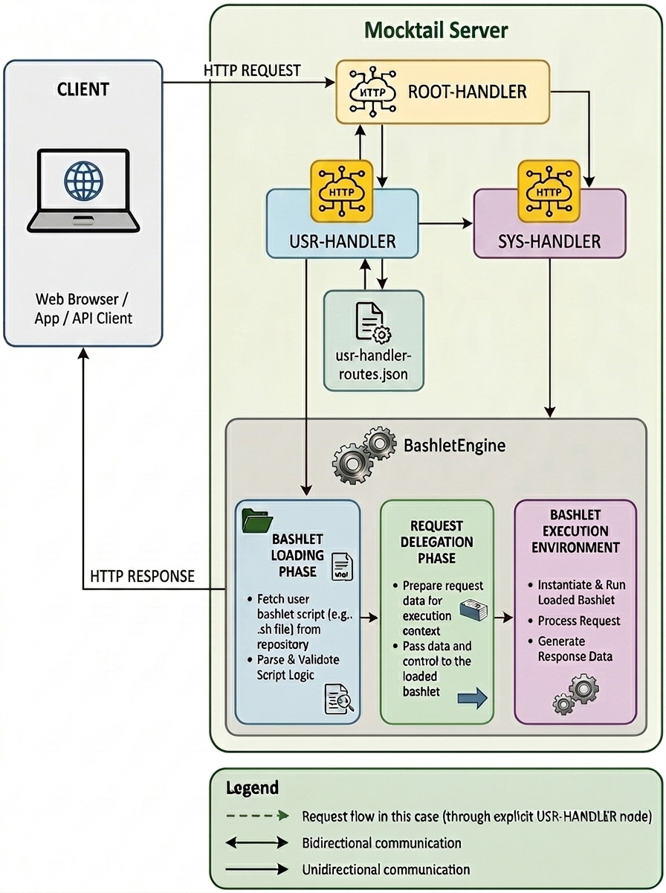

#### 3.2 Creating a Bashlet Script
A minimal Bashlet implementation would look something like as follows, here only a single enpoint function is defined for the purposes of this example, **a real Bashlet would typically have multiple endpoint functions defined** to handle different paths and HTTP methods:

```bash

# --------------------------------------------------------
# Name:  ExampleBashlet 
# Author Giles Thompson
# Date:  21/06/2026
#
# Description:    
# A minimal Bashlet example.
#---------------------------------------------------------


# IMPORTANT: first and foremost source the BashletContext, it supplies helper functions to support parsing of the incoming request object and constructing the response object.
source "$SCRIPT_DIR/res/bashlets/internal/BashletContext"


# An example crate profiles endpoint function, here we just return a 
# sucess string response to the client.
# @route method=post path=/api/profiles/
createProfiles(){

  request="$1"
  response="$2"

   #optionally log the call to the endpoint function. "Log" is 
   #a helper function thats built into Mocktail Server.
   Log "DEBUG" "ExampleBashlet: inside createProfiles..."

    #TODO: In a real endpoint function, this is where you would execute
    #      app-specific business logic i.e. parse the request data from the
    #      provided request object and use it do do any processing pefore 
    #      utilising the response object to dispatch a response to the client
    #      as demonstrated below.

    #here we just dispatch a "success" response message to the client.
    SetBashletResponseBody "$response" "Sucess!"
}
```

Key points to note from the snippet above are as follows:
- Bashlet **endpoint functions are just standard bash functions with the exception that they are annotated with a `@route` annotation in the comment** that specifies the HTTP **method** and **path**.

- Additionally, **`request` and `response` objects are also passed into every endpoint function**, allowing you to access request data and set response data.
- The `Log` function is a built-in helper for logging messages at different levels (DEBUG, INFO, ERROR, etc.).
- The `SetBashletResponseBody` This is a built in helper function that is provided by the BashletContext and is used to set the response body of the HTTP response. Its also possible to forward and/or redirect to other endpoints and ,HTML content using the `SetBashletResponseForward` and `SetBashletResponseRedirect` helper functions respectively, see the docs for more details on these functions.
- The `BashletContext` is sourced at the top of the script to provide a multitude of helper functions for parsing requests and constructing responses.

A more detailed example of how to implement Bashlets is provided in the  [docs](#Documentation), along with a description of the most commonly used helper functions for working with the HTTP request and response objects.

#### 3.3 Referecing Bashlet in Handler config
Once a Bashlet script has been created, it must be referenced in the appropriate handler config file, **By default, Mocktail Server expects user-defined Bashlet Scripts to be referenced in the User Handler config file** located at:

```text
res/handlers/usr/user-handler-routes.json
```
Navigate to this file and add a new entry to the `routes` array for your Bashlet script, specifying the path (i.e., the URL path that should trigger the Bashlet), type, and BashletPath (i.e., the path to the Bashlet script on the filesystem), for example:

```json
 {
     "Title": "Example (User Profile) Bashlet Controller Route",
     "Path": "/example",
     "Type": "bashlet",
     "BashletPath": "/res/bashlets/usr/ExampleBashlet",
     "Description": "An example of a minimal bashlet implementation."
}
```

Thats it!! **Save all changes and restart the server**, your Bashlet should now be live and ready to receive requests. You can test it by sending a request to the specified path using a tool like `curl` or Postman.


## Project layout

The Mocktail project layout is as follows:

```text

├── mocktail
└── res/
    ├── config.json
    ├── bashlets/
    │   ├── internal/
    │   ├── sys/
    │   └── usr/
    ├── handlers/
    │   ├── internal/
    │   ├── sys/
    │   └── usr/
    ├── sys/
    │   ├── mocks/
    │   └── www/
    └── usr/
        ├── mocks/
        └── www/
```

The project layout is intentional and is **designed to separate the internal server logic from user-defined Bashlets, mock collections, static and dynamic web content**. Regardless of what parent directory one is currentlyin (i.e. root,bashlets,handlers,etc), the general guidence regarding the modification of files and directories is as follows:


| Directory | Purpose |
|-----------|---------|
|  `*/internal` | Anything under an **internal** directory contains internal server logic that is vital to ensure the proper functioning of the Mocktail server's core systems. These resources should generally **not** be modified under any circumstances unless you are a developer working on the Mocktail project and are doing so for the purpose of fixing a bug or adding a new feature. |
|  `*/sys` | Anything under a **sys** directory contains system-level resources and logic to support the correct functioning of built-in Mocktail Web applications like **System Management** and **API Mocking**. Whilst these resources are at a higher level than those in the **internal** directory, they are still critical to the default operation of the server. These resources should generally **not** be modified by end users, unless there is a specific requirement to modify how the built-in Mocktail applications function. |
|  `*/usr` | Anything under a **usr** directory contains user-level resources and configurations. These are **always safe for end users to modify**, as they are not critical to the operation of the server. These are typically the resources that users will interact with directly, such as custom Bashlets, user-defined mock collections, and user-specific web content. |


## Documentation

Mocktail is bundled with comprehensive project documentation library that covers all aspects of the server, including the finer details of API Mocking, static and dynamic web hosting and Server configuration/management options. Once you are logged into the server, you can access the docs from the main dashboard under the **Docs** menu item to the left of the screen:
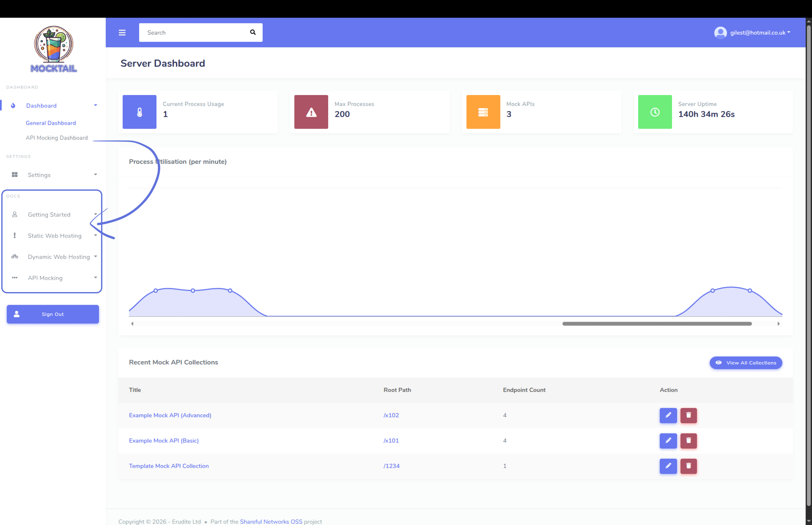


## License

This project is licensed under the MIT license. See the `LICENSE` file for details.
